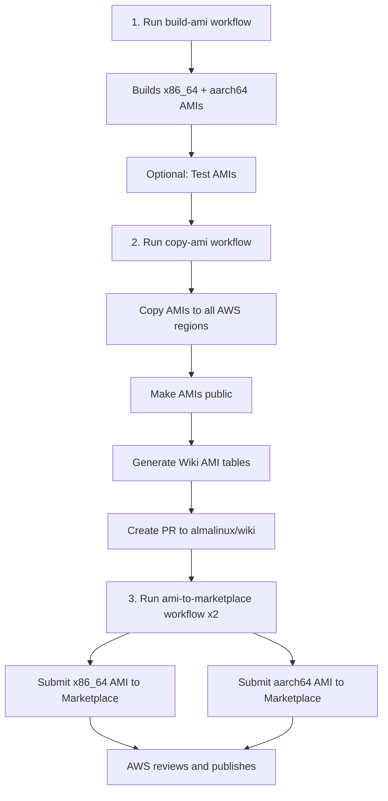

# AWS Marketplace Publishing

## Overview

This repository includes GitHub Actions workflows for building, distributing, and publishing AlmaLinux OS AMIs (Amazon Machine Images) to AWS Marketplace. The process is split into three separate workflows that are run sequentially.

## Workflows

### 1. `.github/workflows/build-ami.yml` — Build AMI

Builds AlmaLinux OS AMIs from source using Packer and Ansible.

**What it does:**
- Builds AMIs for both x86_64 and aarch64 architectures in parallel
- Uses EBS Surrogate build strategy with Packer
- Finds the latest existing AlmaLinux AMI as the source/base image
- Grants launch permission to the AlmaLinux infrastructure account
- Optionally tests the built AMIs by launching instances from them
- Sends Mattermost notifications and generates job summaries

**Usage:**
```
Trigger via GitHub UI: Actions → AWS AMI Build

Inputs:
  - version_major:    AlmaLinux major version (choice: kitten_10, 10, 9, 8)
  - test_ami:         Test built AMI (default: true)
  - notify_mattermost: Send notification to Mattermost (default: true)
```

### 2. `.github/workflows/copy-ami.yml` — Copy AMI to Regions

Copies built AMIs to all available AWS regions and makes them public.

**What it does:**
- Takes x86_64 and aarch64 AMI IDs as input
- Copies each AMI to all available AWS regions using `tools/aws_ami_mirror.py`
- Makes the copied AMIs public in all regions
- Generates CSV and Markdown tables of AMI IDs per region
- Creates a Pull Request to the AlmaLinux Wiki (`almalinux/wiki`) with updated AMI tables
- Sends Mattermost notifications and generates job summaries

**Usage:**
```
Trigger via GitHub UI: Actions → AWS AMI copy to Regions, make Public

Inputs:
  - x86_64_ami_id:    AMI ID for x86_64 (required)
  - aarch64_ami_id:   AMI ID for aarch64 (required)
  - make_public:      Copy to all regions and make public (default: true)
  - draft:            Create Wiki PR as draft (default: true)
  - notify_mattermost: Send notification to Mattermost (default: true)
```

### 3. `.github/workflows/ami-to-marketplace.yml` — Publish to Marketplace

Releases an AMI to the corresponding AWS Marketplace product.

**What it does:**
- Takes a single AMI ID as input
- Describes the AMI to extract version, architecture, and OS information
- Maps the AMI to the corresponding AWS Marketplace product ID
- Renders a Marketplace change set from a JSON template
- Submits the change set via `aws marketplace-catalog start-change-set`
- Supports a test mode using a non-public dev product
- Sends Mattermost notifications and generates job summaries

**Usage:**
```
Trigger via GitHub UI: Actions → AWS AMI to Marketplace release

Inputs:
  - ami_id:                AMI ID to release (required)
  - release_to_marketplace: Submit to Marketplace (default: true)
  - public_product:        Use public product ID (default: false)
  - notify_mattermost:     Send notification to Mattermost (default: false)
```

**Note:** The marketplace workflow processes one AMI at a time. To publish both architectures, run it twice — once for x86_64 and once for aarch64.

## Required GitHub Configuration

### Secrets
| Secret | Description |
|--------|-------------|
| `AWS_ACCESS_KEY_ID` | AWS access key ID |
| `AWS_SECRET_ACCESS_KEY` | AWS secret access key |
| `GIT_HUB_TOKEN` | GitHub PAT with repo access (used for Packer plugins and Wiki PRs) |
| `MATTERMOST_WEBHOOK_URL` | Mattermost incoming webhook URL |

### Variables (`vars.*`)
| Variable | Description |
|----------|-------------|
| `AWS_REGION` | Primary AWS region for builds and API calls |
| `MATTERMOST_CHANNEL` | Mattermost channel for notifications |

## Prerequisites

1. **AWS IAM Credentials**
   - The AWS credentials must have permissions for:
     - **EC2**: `describe-images`, `copy-image`, `modify-image-attribute`, `create-image` (for Packer builds)
     - **Marketplace Catalog**: `describe-entity`, `start-change-set`
   - A separate IAM role (`alma-images-marketplace-role`) is used for Marketplace AMI access

2. **Packer Templates**
   - Packer templates must exist in the repository root matching the naming convention:
     `amazon-ebssurrogate.almalinux_{variant}_ami_{arch}`
   - Packer is installed from the HashiCorp APT repository during the build

3. **Source AMIs**
   - The build workflow automatically finds the latest existing AlmaLinux AMI (owned by account `764336703387`) as the source image

4. **AlmaLinux Wiki Repository**
   - The copy workflow creates PRs against `almalinux/wiki` with updated AMI tables
   - Requires `GIT_HUB_TOKEN` with write access to that repository

5. **AWS Marketplace Products**
   - Products must already exist in AWS Marketplace
   - Product IDs are hardcoded in the marketplace workflow (see [Product ID Mapping](#product-id-mapping))

## Supported Products

### Product ID Mapping

| Product | Architecture | Product ID |
|---------|-------------|------------|
| AlmaLinux OS 8 | x86_64 | `c076b20a-2305-4771-823f-944909847a05` |
| AlmaLinux OS 8 | arm64 | `744775f7-4efd-4c75-ac32-eb2540b4030c` |
| AlmaLinux OS 9 | x86_64 | `3c74c2ba-21a2-4dc1-a65d-fd0ee7d79900` |
| AlmaLinux OS 9 | arm64 | `2d219cc1-aa44-4a1e-b6fe-258d4ebd3cdb` |
| AlmaLinux OS 10 | x86_64 | `prod-cvyxsvsdzfjx4` |
| AlmaLinux OS 10 | arm64 | `prod-qgpr5bqxuzt5i` |
| AlmaLinux OS Kitten 10 | x86_64 | `prod-svbminwb7w5se` |
| AlmaLinux OS Kitten 10 | arm64 | `prod-npz256ulofnae` |
| (Dev/Test) | any | `prod-t4oyq2p42jn2u` |

The dev/test product is used when `public_product` is set to `false`.

## End-to-End Process

### Typical Release Flow



### Step 1: Build AMIs (`build-ami`)

1. Checks out the repository
2. Configures AWS credentials
3. Finds the latest AlmaLinux source AMI for the target version and architecture
4. Installs Packer and Ansible
5. Runs the Packer EBS Surrogate build template
6. Extracts the new AMI ID from the build log
7. Grants launch permission to the infrastructure account (`383541928683`)
8. Optionally tests the AMI by launching an instance (using [runs-on](https://runs-on.com/) self-hosted runners)

The test step:
- Launches an instance from the built AMI
- Verifies the OS release string matches
- Verifies the architecture matches
- Runs `dnf check-update` to confirm repo access
- Captures the installed package list as a build artifact

### Step 2: Copy to Regions (`copy-ami`)

1. Copies each AMI to all available AWS regions using `tools/aws_ami_mirror.py`
2. Makes all copied AMIs public
3. Generates per-region AMI ID tables in CSV and Markdown formats
4. Merges x86_64 and aarch64 tables, sorted by region
5. Commits the data to a new branch in the `almalinux/wiki` repository
6. Creates a Pull Request (optionally as draft) to update the Wiki

### Step 3: Publish to Marketplace (`ami-to-marketplace`)

1. Describes the AMI to extract metadata (version, architecture, name)
2. Determines the OS version and maps to the correct Marketplace product ID
3. Fetches the recommended instance type from the existing product (falls back to `t3.small`/`t4g.small`)
4. Renders a change set from `.github/aws_marketplace_change_set.json.template`
5. Submits the change set to AWS Marketplace Catalog API
6. AWS reviews and publishes the new version

### Marketplace Change Set

The change set template (`.github/aws_marketplace_change_set.json.template`) uses the `AddDeliveryOptions` change type with these parameters:

| Parameter | Value |
|-----------|-------|
| Version Title | AMI version string (e.g., `9.6.20250522`) |
| OS Name | `OTHERLINUX` |
| Username | `ec2-user` |
| Security Group | TCP/22 (SSH) from `0.0.0.0/0` |
| Recommended Instance Type | From existing product or `t3.small`/`t4g.small` |

## Helper Tools

### `tools/aws_ami_mirror.py`

Python script that copies an AMI to all available AWS regions and makes it public.

**Dependencies:** `boto3`, `markdown_table` (installed via `pip3` during the workflow)

**What it does:**
- Takes a source AMI ID
- Copies the AMI to every available AWS region concurrently
- Waits for all copies to become available
- Makes each copy public
- Generates Markdown and CSV files with per-region AMI IDs

## Manual Steps

1. **After `build-ami`**: Note the AMI IDs from the job output or Mattermost notification to use as input for the next workflow
2. **After `copy-ami`**: Review and merge the Wiki PR created in `almalinux/wiki`
3. **After `ami-to-marketplace`**: Monitor the change set status in the [AWS Marketplace Management Portal](https://aws.amazon.com/marketplace/management/requests/) — AWS reviews and publishes automatically

## Troubleshooting

### Common Issues

1. **"Failed to get AMI ID" during build**
   - The source AMI lookup failed — ensure AlmaLinux AMIs exist in the primary region owned by account `764336703387`
   - Check the `version_major` input matches an existing AMI name pattern

2. **Build fails with Packer errors**
   - Check the uploaded build log artifact for details
   - Ensure the Packer template exists for the selected variant and architecture
   - Verify AWS credentials have EC2 permissions

3. **AMI copy fails or times out**
   - `aws_ami_mirror.py` copies to all regions concurrently
   - Some regions may be slow; the script handles retries internally
   - Check if the source AMI is in `available` state

4. **Wiki PR creation fails**
   - Ensure `GIT_HUB_TOKEN` has write access to `almalinux/wiki`
   - A branch with the same name may already exist from a previous run

5. **"Unsupported AlmaLinux release" in marketplace workflow**
   - The AMI name/version/architecture combination doesn't match any known product
   - Update the product ID mapping in the workflow if a new product was created

6. **Marketplace change set fails**
   - Check the change set status in the AWS Marketplace Management Portal
   - Ensure the AMI is in `available` state and publicly accessible
   - Verify the IAM role ARN (`alma-images-marketplace-role`) is correctly configured

## Support

- AWS Marketplace Management Portal: https://aws.amazon.com/marketplace/management/
- AlmaLinux Wiki: https://wiki.almalinux.org
- AlmaLinux Cloud SIG Chat: https://chat.almalinux.org/almalinux/channels/sigcloud
- Workflow run logs: GitHub Actions tab in the repository
