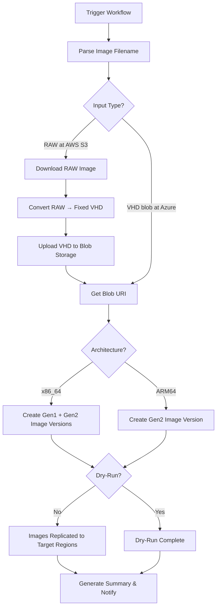

# Azure Community Gallery Publishing

## Overview

This repository includes a GitHub Actions workflow and a helper script for publishing AlmaLinux OS images to Azure Compute Galleries (formerly Shared Image Galleries).

## Files

### `.github/workflows/azure-to-gallery.yml`

Workflow for releasing AlmaLinux OS images to an Azure Compute Gallery.

**What it does:**
- Accepts either a RAW image URL (from AWS S3) or an already-uploaded VHD blob URL
- Parses the image filename to extract version, timestamp, and architecture
- If RAW: downloads the image, converts it to fixed VHD via `qemu-img`, and uploads to Azure Blob Storage
- If VHD: uses the provided blob URL directly
- Creates image definition versions in the Azure Compute Gallery, replicated across multiple regions
- Supports dry-run mode for testing without making changes
- Supports both a CI (private) gallery and a public gallery
- Sends Mattermost notifications and generates job summaries

**Usage:**
```
Trigger via GitHub UI: Actions → Azure image to Gallery release

Inputs:
  - url_type:          Image format (choice: "RAW at AWS S3", "VHD blob at Azure")
  - image_url:         The image URL (required)
  - dry-run-mode:      Dry-run mode (default: true)
  - public_gallery:    Release to public Gallery (default: false)
  - notify_mattermost: Send notification to Mattermost (default: false)
```

### `tools/azure_uploader.sh`

Bash script that handles the actual image conversion, upload, and gallery operations.

**Dependencies:** `azure-cli`, `qemu-img`, `jq`

**What it does:**
- Converts RAW images to fixed-size VHD format (rounded to 1 MB boundary)
- Uploads VHD blobs to Azure Storage with MD5 validation
- Creates image definition versions in the Compute Gallery
- For x86_64 images: creates both Gen1 and Gen2 image definition versions
- For ARM images: creates Gen2 image definition version only
- Supports dry-run mode (default) — pass `-f` to execute actual operations
- Calculates unique image indices to avoid naming collisions
- Replicates images to multiple target regions

**Usage:**
```bash
# Dry-run (default): shows what would be executed
./azure_uploader.sh -d 9.6 -t default -i AlmaLinux-9-Azure-9.6.raw

# Actual upload from RAW image
./azure_uploader.sh -d 9.6 -t default -i AlmaLinux-9-Azure-9.6.raw -f

# Upload from existing VHD blob URL
./azure_uploader.sh -d 9.6 -t default -u https://almalinux.blob.core.windows.net/... -f

# Upload to public gallery
./azure_uploader.sh -d 9.6 -t default -i AlmaLinux-9-Azure-9.6.raw -f -g almalinux
```

## Required GitHub Configuration

### Secrets
| Secret | Description |
|--------|-------------|
| `AZURE_CLIENT_ID` | Azure service principal client ID |
| `AZURE_TENANT_ID` | Azure tenant ID |
| `AZURE_SUBSCRIPTION_ID` | Azure subscription ID |
| `MATTERMOST_WEBHOOK_URL` | Mattermost incoming webhook URL |

### Variables (`vars.*`)
| Variable | Description |
|----------|-------------|
| `MATTERMOST_CHANNEL` | Mattermost channel for notifications |

### GitHub Permissions
The workflow requires:
- `id-token: write` — for Azure OIDC authentication
- `contents: read` — for repository checkout

## Prerequisites

1. **Azure Service Principal**
   - Must be configured for OIDC (federated credentials) authentication with GitHub Actions
   - Requires permissions to:
     - Upload blobs to the Azure Storage account
     - Create/manage image definition versions in the Compute Gallery

2. **Azure Storage Account**
   - Default storage account: `almalinux`
   - Contains per-version/type storage containers (e.g., `8-default`, `9-arm64`, `almalinux-10`, `kitten-10`)

3. **Azure Compute Galleries**
   - CI/private gallery: `almalinux_ci` (default)
   - Public gallery: `almalinux` (used when `public_gallery` is `true`)
   - Resource group: `rg-alma-images`

4. **Image Definitions**
   - Image definitions must already exist in the gallery for each version/architecture/generation combination
   - The script generates definition names automatically (see [Image Definition Naming](#image-definition-naming))

## Supported Image Types

| Image Type | Architecture | VM Generations | Description |
|------------|-------------|----------------|-------------|
| `default` | x86_64 | Gen1 + Gen2 | Standard x86_64 images |
| `arm64` | aarch64/arm64 | Gen2 only | Standard ARM64 images |
| `arm64-64k` | aarch64 | Gen2 only | ARM64 with 64K page size (AlmaLinux 9+) |

## Image Filename Patterns

The workflow parses filenames to extract metadata. Two input formats are supported:

### RAW Images (from AWS S3)
```
AlmaLinux-{major}-Azure-{version}-{date}.{index}.{arch}.raw
```
Example: `AlmaLinux-10-Azure-10.0-20250529.0.x86_64.raw`

### VHD Images (Modern format)
```
AlmaLinux-{major}-Azure-{version}-{date}.{index}[-64k].{arch}.vhd
```
Example: `AlmaLinux-10-Azure-10.0-20250529.0-64k.aarch64.vhd`

### VHD Images (Legacy format)
```
almalinux-{version}-{arch}.{date}-{index}.vhd
```
Example: `almalinux-9.6-arm64.20250522-01.vhd`

### Extracted Metadata
- `RELEASE_VERSION` — distribution version (e.g., `9.6`, `10.0`, `10`)
- `TIMESTAMP` — date with optional index (e.g., `20250529.0`)
- `IMAGE_TYPE` — `default`, `arm64`, or `arm64-64k` (derived from architecture and 64K page size flag)

## Image Definition Naming

The script generates Azure Compute Gallery image definition names following these patterns:

| Version | Type | Generation | Definition Name |
|---------|------|------------|-----------------|
| 8.x | default | Gen1 | `almalinux-8-gen1` |
| 8.x | default | Gen2 | `almalinux-8-gen2` |
| 8.x | arm64 | Gen2 | `almalinux-8-arm64` |
| 9.x | default | Gen1 | `almalinux-9-gen1` |
| 9.x | default | Gen2 | `almalinux-9-gen2` |
| 9.x | arm64 | Gen2 | `almalinux-9-arm64` |
| 9.x | arm64-64k | Gen2 | `almalinux-9-arm64-64k` |
| 10.x | default | Gen1/2 | `almalinux-10-gen1`/`almalinux-10-gen2` (proposed) |
| 10.x | arm64 | Gen2 | `almalinux-ci-10-arm64-gen2` |
| 10.x | arm64-64k | Gen2 | `almalinux-ci-10-arm64-64k-gen2` |
| Kitten 10 | default | Gen1 | `almalinux-ci-kitten-10-x64-gen1` |
| Kitten 10 | default | Gen2 | `almalinux-ci-kitten-10-x64-gen2` |
| Kitten 10 | arm64 | Gen2 | `almalinux-ci-kitten-10-arm64-gen2` |

## Storage Container Naming

Blob containers are named per major version and image type:

| Version | Type | Container Name |
|---------|------|---------------|
| 8.x | default | `8-default` |
| 8.x | arm64 | `8-arm64` |
| 9.x | default | `9-default` |
| 9.x | arm64 | `9-arm64` |
| 9.x | arm64-64k | `9-arm64-64k` |
| 10.x | any | `almalinux-10` |
| Kitten 10 | any | `kitten-10` |

## Workflow Process



### RAW Image Processing (full flow)

1. Downloads the RAW image from AWS S3 to `/mnt` (which has ~70 GB of disk space)
2. Rounds the image size up to the nearest 1 MB boundary
3. Resizes the RAW image if needed using `qemu-img resize`
4. Converts RAW to fixed VHD format using `qemu-img convert`
5. Calculates the MD5 checksum of the VHD blob
6. Uploads the VHD blob to Azure Blob Storage with MD5 validation
7. Creates image definition version(s) in the gallery from the blob URI

### VHD Blob Processing (shortened flow)

1. Uses the provided VHD blob URL directly
2. Creates image definition version(s) in the gallery from the existing blob URI

### Target Regions

Images are replicated to the following Azure regions (with 1 replica each):

- `eastus`
- `germanywestcentral`
- `westus2`
- `southeastasia`
- `southcentralus`

## Testing

1. **Dry-Run Mode** (default)
   - Set `dry-run-mode: true` (default)
   - The script shows all commands that would be executed without making any changes
   - Useful for verifying filename parsing and parameter generation

2. **CI Gallery Release**
   - Set `dry-run-mode: false`, `public_gallery: false`
   - Uploads to the `almalinux_ci` private gallery
   - Verify the image definition version in the Azure Portal

3. **Public Gallery Release**
   - Set `dry-run-mode: false`, `public_gallery: true`
   - Uploads to the `almalinux` public gallery

## Troubleshooting

### Common Issues

1. **"Could not parse filename" error**
   - Ensure the image filename matches one of the supported patterns (RAW or VHD)
   - Check for unexpected characters or missing version/date components

2. **Image download fails**
   - Verify the RAW image URL is publicly accessible
   - The download goes to `/mnt` which has ~70 GB of space on GitHub runners — ensure the image fits

3. **VHD conversion fails**
   - Ensure `qemu-utils` is installed (the workflow installs it automatically)
   - Check that the RAW image is a valid disk image

4. **Azure login fails**
   - Verify `AZURE_CLIENT_ID`, `AZURE_TENANT_ID`, and `AZURE_SUBSCRIPTION_ID` secrets are correct
   - Ensure the service principal has OIDC federated credentials configured for the GitHub repository

5. **Blob upload fails**
   - Check that the storage container exists for the version/type combination
   - Verify the service principal has `Storage Blob Data Contributor` role on the storage account

6. **Image definition version creation fails**
   - Ensure the image definition already exists in the gallery
   - Check that the version number doesn't already exist (use dry-run to preview)
   - Verify the service principal has `Contributor` role on the gallery resource group

7. **Image with same name already exists**
   - The script auto-increments an index to generate unique blob names
   - If collisions still occur, check existing blobs in the storage container

## Support

- Azure Portal: https://portal.azure.com
- Azure Compute Gallery docs: https://learn.microsoft.com/en-us/azure/virtual-machines/azure-compute-gallery
- AlmaLinux Cloud SIG Chat: https://chat.almalinux.org/almalinux/channels/sigcloud
- Workflow run logs: GitHub Actions tab in the repository
