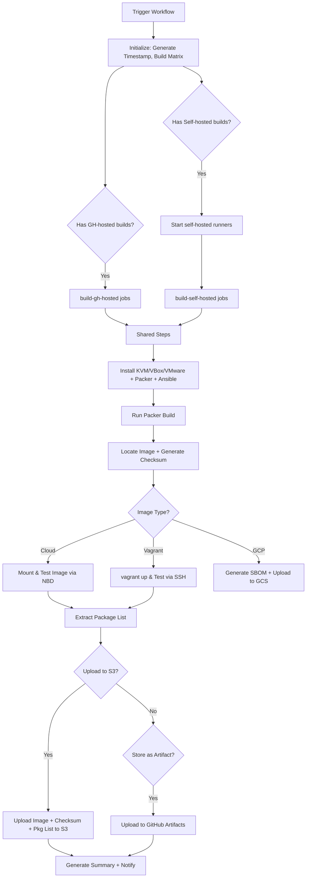

# Build Cloud and Vagrant Images

## Overview

This repository includes a GitHub Actions workflow and a reusable composite action for building AlmaLinux OS cloud and Vagrant images using Packer. This is the primary build pipeline that produces images for all supported cloud platforms and hypervisors.

## Files

### `.github/workflows/build.yml`

Main workflow that orchestrates image builds across multiple platforms, architectures, and variants.

**What it does:**
- Builds cloud images (Azure, GCP, GenCloud, OCI, OpenNebula, Hyper-V) and Vagrant boxes (libvirt, VirtualBox, VMware)
- Supports AlmaLinux 8, 9, 10, and Kitten 10
- Builds for both x86_64 and aarch64 architectures, plus x86_64_v2 and aarch64 64K page variants
- Splits work between GitHub-hosted runners (x86_64) and self-hosted runners (aarch64, VMware)
- Generates SHA-256 checksums for all images
- Optionally stores images as GitHub Actions artifacts
- Optionally uploads images to AWS S3 with public tagging
- Optionally runs image tests
- Sends Mattermost notifications

**Usage:**
```
Trigger via GitHub UI: Actions → Build Cloud and Vagrant Images

Inputs:
  - date_time_stamp:    Custom timestamp YYYYMMDDhhmmss (auto-generated if empty)
  - version_major:      AlmaLinux version (choice: 10-kitten, 10, 9, 8)
  - image_type:         Cloud image type (NONE, ALL, azure, gcp, gencloud, hyperv, oci, opennebula)
  - vagrant_type:       Vagrant image type (NONE, ALL, vagrant_libvirt, vagrant_virtualbox, vagrant_vmware)
  - self-hosted:        Allow self-hosted runners (default: true)
  - self_hosted_runner: Self-hosted runner type (self-hosted, aws-ec2)
  - run_test:           Test built images - vagrant only (default: true)
  - store_as_artifact:  Store images as GitHub artifacts (default: false)
  - upload_to_s3:       Upload to S3 bucket (default: true)
  - notify_mattermost:  Send notifications (default: false)
```

### `.github/actions/shared-steps/action.yml`

Reusable composite action containing the actual build, test, upload, and notification logic.

**What it does:**
- Detects the runner OS (Ubuntu or RHEL) and installs appropriate packages
- Installs KVM, Packer, and Ansible
- Configures virtualization (KVM, VirtualBox, or VMware depending on image type)
- Runs Packer to build the image
- Locates the output image and generates SHA-256 checksum
- Tests the image (mounts qcow2/raw for cloud images, or runs `vagrant up` for Vagrant boxes)
- Generates SBOM (Software Bill of Materials) for GCP images
- Uploads images and artifacts to S3 and/or GCP storage
- Generates job summaries and Mattermost notifications

## Required GitHub Configuration

### Secrets
| Secret | Description |
|--------|-------------|
| `AWS_ACCESS_KEY_ID` | AWS access key for S3 uploads |
| `AWS_SECRET_ACCESS_KEY` | AWS secret key for S3 uploads |
| `GIT_HUB_TOKEN` | GitHub PAT (used for Packer plugins and self-hosted runner provisioning) |
| `MATTERMOST_WEBHOOK_URL` | Mattermost incoming webhook URL |
| `EC2_AMI_ID_AL9_X86_64` | AMI ID for x86_64 self-hosted EC2 runner |
| `EC2_AMI_ID_AL9_AARCH64` | AMI ID for aarch64 self-hosted EC2 runner |
| `EC2_SUBNET_ID` | EC2 subnet for self-hosted runners |
| `EC2_SECURITY_GROUP_ID` | EC2 security group for self-hosted runners |

### Variables (`vars.*`)
| Variable | Description |
|----------|-------------|
| `AWS_REGION` | AWS region for S3 and EC2 |
| `AWS_S3_BUCKET` | S3 bucket name for storing built images |
| `MATTERMOST_CHANNEL` | Mattermost channel for notifications |
| `EC2_AMI_ID_AL9_X86_64` | AMI ID for RunsOn x86_64 runners (AlmaLinux org only) |

### Permissions
The workflow requires:
- `id-token: write` — for GCP Workload Identity Federation and Azure OIDC
- `contents: read` — for repository checkout

## Supported Image Types

### Cloud Images

| Type | Output Format | Architectures | Notes |
|------|--------------|---------------|-------|
| `azure` | `.raw` | x86_64, aarch64, aarch64-64k | Azure VHD source; 64K page variant for AL9+ |
| `gcp` | `.tar.gz` | x86_64, aarch64 | Google Cloud; includes SBOM generation |
| `gencloud` | `.qcow2` | x86_64, aarch64 | Generic cloud (OpenStack, etc.) |
| `hyperv` | `.box` | x86_64 only | Hyper-V Vagrant box; built with QEMU |
| `oci` | `.qcow2` | x86_64, aarch64 | Oracle Cloud Infrastructure |
| `opennebula` | `.qcow2` | x86_64, aarch64 | OpenNebula platform |

### Vagrant Boxes

| Type | Provider | Architectures | Runner |
|------|----------|---------------|--------|
| `vagrant_libvirt` | libvirt (KVM/QEMU) | x86_64 | GitHub-hosted |
| `vagrant_virtualbox` | VirtualBox | x86_64 | GitHub-hosted |
| `vagrant_vmware` | VMware Desktop | x86_64 | Self-hosted (networking issues on GH runners) |

### Version Variants

| Input | Variants Built | Notes |
|-------|---------------|-------|
| `8` | `8` | Single variant |
| `9` | `9` | Single variant; Azure also builds `9-64k` on aarch64 |
| `10` | `10`, `10-v2` | v2 = x86_64_v2 microarchitecture; Azure also builds `10-64k` |
| `10-kitten` | `10-kitten`, `10-kitten-v2` | Kitten builds; Azure also builds `10-kitten-64k` |

The `-v2` suffix produces images with x86_64_v2 microarchitecture level support. The `-64k` suffix produces aarch64 images with 64K page size (Azure only, AL9+).

## Build Matrix

The workflow splits builds into two runner groups:

### GitHub-Hosted (`build-gh-hosted`)

Runs on GitHub-hosted or [RunsOn](https://runs-on.com/) metal instances (when in the AlmaLinux org).

Builds: all x86_64 cloud images, Vagrant libvirt, Vagrant VirtualBox

### Self-Hosted (`build-self-hosted`)

Runs on self-hosted EC2 instances (via `ec2-action-builder`) or RunsOn ARM instances.

Builds: all aarch64 cloud images, Vagrant VMware (x86_64)

### Matrix Exclusions

Certain variant/type combinations are excluded:
- **v2 variants**: excluded from Azure, OCI, GCP, DigitalOcean (cloud images don't use v2)
- **64k variants**: excluded from OCI, GenCloud, OpenNebula (only Azure supports 64K page)
- **OCI**: excluded for Kitten (aarch64)

## Workflow Process



## S3 Upload Structure

Built images are uploaded to S3 with the following path structure:

```
s3://{bucket}/images/{version_major}/{release}/{type}/{timestamp}/
```

Examples:
```
s3://almalinux-cloud/images/9/9.6/azure/20260220143000/AlmaLinux-9-Azure-9.6-20260220.x86_64.raw
s3://almalinux-cloud/images/9/9.6/vagrant/20260220143000/AlmaLinux-9-Vagrant-libvirt-9.6-20260220.0.x86_64.box
s3://almalinux-cloud/images/kitten/10/azure/20260220143000/AlmaLinux-Kitten-Azure-10-20260220.0.x86_64.raw
```

All uploaded objects are tagged with `public=yes`.

## Image Testing

### Cloud Image Testing

For cloud images (not GCP, not Vagrant), the shared action:
1. Loads the `nbd` kernel module
2. Attaches the image using `qemu-nbd` (read-only)
3. Mounts the root partition (partition 4 for x86_64, partition 3 for aarch64)
4. Verifies `/etc/almalinux-release` matches the expected release string
5. Verifies the architecture of the `almalinux-release` package
6. Extracts the list of installed RPM packages

### Vagrant Image Testing

For Vagrant boxes (when `run_test` is enabled):
1. Installs Vagrant and the appropriate provider plugin
2. Adds the built box locally
3. Creates a Vagrantfile with 2 CPUs and 2 GB RAM
4. Runs `vagrant up` with the correct provider
5. Verifies `/etc/almalinux-release` via SSH
6. Verifies architecture via SSH
7. Runs `dnf check-update` to confirm repository access
8. Extracts installed package list via SSH
9. Cleans up the VM and box

### GCP-Specific Steps

For GCP images, additional steps are performed:
1. Generates SBOM (Software Bill of Materials) using `cloud-images-sbom-tools`
2. Uploads the image tarball to a GCS bucket
3. Uploads the SBOM to a separate GCS bucket
4. Builds the `gce_image_publish` tool from `GoogleCloudPlatform/compute-image-tools`
5. Creates a test image in the GCP project

## Packer Configuration

The shared action constructs Packer source names and options dynamically based on the image type and variant. The general pattern is:

```
{builder}.almalinux-{version}-{type}-{arch}      (AL 8/9)
{builder}.almalinux_{version}_{type}_{arch}       (AL 10/Kitten)
```

Where `{builder}` is `qemu`, `virtualbox-iso`, or `vmware-iso`.

### Packer Options by Runner OS

| Runner OS | QEMU Binary | OVMF Firmware |
|-----------|-------------|---------------|
| Ubuntu | `/usr/bin/qemu-system-{arch}` | `/usr/share/OVMF/OVMF_CODE_4M.fd` |
| RHEL | `/usr/libexec/qemu-kvm` | (default) |

## Troubleshooting

### Common Issues

1. **Packer build fails**
   - Check the Packer template exists for the variant/type/arch combination
   - Ensure the runner has enough disk space and RAM
   - For QEMU builds, verify KVM is available (`/dev/kvm` exists and is accessible)

2. **KVM permissions error**
   - The workflow configures udev rules for KVM access
   - On self-hosted runners, ensure the runner user is in the `kvm` group

3. **VirtualBox or VMware build fails**
   - VirtualBox and VMware require KVM to be unloaded (they provide their own hypervisor)
   - VMware requires a specific bundle version and license configuration

4. **Image test fails (cloud)**
   - Ensure `nbd` kernel module is available
   - Check that the root partition number is correct for the architecture

5. **Vagrant test fails**
   - `vagrant up` may fail with SSH connection issues (known issue with libvirt)
   - VirtualBox tests may not work on standard GitHub runners (use self-hosted)
   - VMware requires the `vagrant-vmware-utility` service running

6. **S3 upload fails**
   - Verify AWS credentials have S3 write permissions
   - Check the bucket name and region are correct

7. **GCP-related steps fail**
   - Verify Workload Identity Federation is configured for the repository
   - Check the GCS bucket permissions

8. **Self-hosted runner doesn't start**
   - Verify EC2 AMI IDs, subnet, and security group secrets
   - Check AWS credentials have EC2 launch permissions
   - The `ec2-action-builder` has a 30-minute TTL by default

## Support

- Packer Documentation: https://developer.hashicorp.com/packer/docs
- AlmaLinux Cloud SIG Chat: https://chat.almalinux.org/almalinux/channels/sigcloud
- Workflow run logs: GitHub Actions tab in the repository
