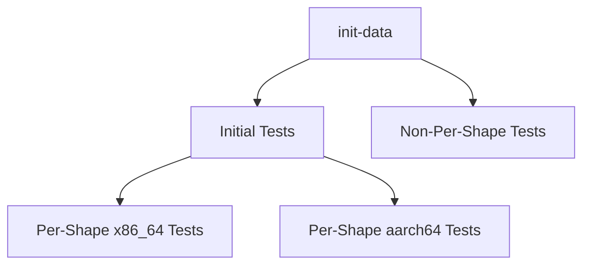
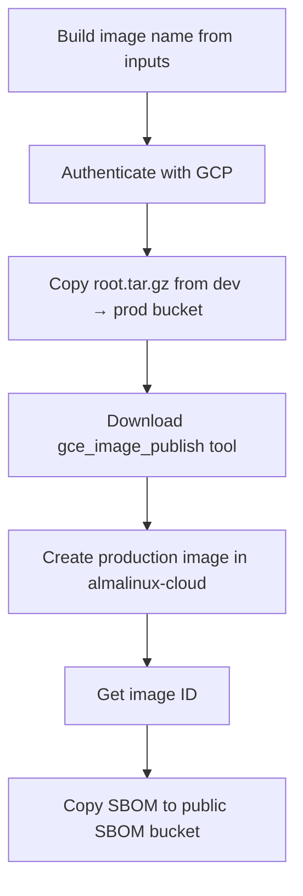
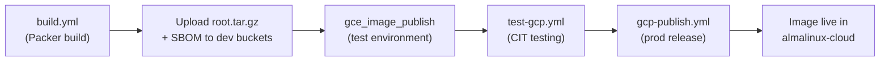

# Google Cloud Platform Image Testing & Publishing

## Overview

This document describes the GitHub Actions workflows used to **test** and **publish** AlmaLinux OS images on Google Cloud Platform (GCP). The process is split into two independent workflows:

| Workflow | File | Purpose |
| :--- | :--- | :--- |
| **GCP cloud-image-tests** | `test-gcp.yml` | Run Google's [Cloud Image Tests](https://github.com/GoogleCloudPlatform/cloud-image-tests) (CIT) against images in the dev project across many machine shapes |
| **GCP Image Publish** | `gcp-publish.yml` | Copy a tested image from the dev project to the production `almalinux-cloud` project and publish its SBOM |

Both workflows are triggered manually via `workflow_dispatch`.


## GCP Projects

| Project | Project ID | Role |
| :--- | :--- | :--- |
| Dev Images | `almalinux-dev-images-469421` | Holds newly built images for testing |
| Image Testing | `almalinux-image-testing-469421` | Runs CIT test VMs |
| Image Release (prod) | `almalinux-image-release` | Work project for the publish tool |
| Production | `almalinux-cloud` | Public-facing project with released images |


## Authentication

Both workflows use **Workload Identity Federation** (no static keys) via `google-github-actions/auth@v2`.

| Workflow | Workload Identity Pool | Service Account |
| :--- | :--- | :--- |
| Testing | `projects/527193872801/…/github-actions/providers/github` | `github-actions-image-testing@almalinux-image-testing-469421.iam.gserviceaccount.com` |
| Publishing | `projects/1071098808632/…/github-actions/providers/github` | `gh-actions-prod-release@almalinux-image-release.iam.gserviceaccount.com` |

Required GitHub permissions on the jobs: `id-token: write`, `contents: read`.


## Image Naming Convention

GCP image names follow the pattern:

```
almalinux-{version_major}[-arm64]-v{YYYYMMDD}
```

Examples:
- `almalinux-9-v20250920` — AlmaLinux 9, x86_64
- `almalinux-10-arm64-v20251205` — AlmaLinux 10, AArch64

Image families (used for "latest" resolution in testing):

```
almalinux-{version_major}[-arm64]
```


## Workflow 1 — Testing (`test-gcp.yml`)

### Inputs

| Input | Type | Required | Default | Description |
| :--- | :--- | :---: | :--- | :--- |
| `version_major` | choice | ✅ | `10` | `10-kitten`, `10`, `9`, or `8` |
| `arch` | choice | ✅ | `ALL` | `ALL`, `x86_64`, or `aarch64` |
| `image_override` | string | ❌ | _(empty)_ | Full GCP image path to test directly, overrides `version_major` |

When `image_override` is empty, the workflow resolves the latest image from the family:

```
projects/almalinux-dev-images-469421/global/images/family/almalinux-{version_major}[-arm64]
```

### Test Stages

The testing workflow is organized into four sequential/parallel job groups:



#### 1. `init-data`

Determines the GCP image path to test based on inputs. If `image_override` is provided it is used directly; otherwise the image family path is constructed.

#### 2. `test-gcp-initialtest` — Initial Smoke Tests

Runs a subset of CIT tests (`lssd`, `disk`, `vmspec`) with **high parallelism** (`-parallel_count 20`) to get quick feedback on obvious regressions before the full per-shape matrix runs.

- Runs for each architecture in the matrix.
- Uses fixed shapes: `c4-standard-8` (x86_64), `c4a-standard-8` (aarch64).

#### 3. `test-gcp-nonpershape` — Non-Per-Shape Tests

Runs CIT tests that are hard-coded to specific shapes internally (filter: `lssd`, `disk`, `vmspec`). Running these against every shape would be redundant since CIT forces specific shapes regardless.

- Uses a slower stagger (`-parallel_stagger 10s`).

#### 4. `test-gcp-pershape-x86_64` / `test-gcp-pershape-aarch64` — Per-Shape Tests

These are the comprehensive tests that run after the initial smoke tests pass. Each test runs the full CIT filter on a specific machine shape:

**CIT test filter:**
```
cvm|livemigrate|suspendresume|loadbalancer|guestagent|hostnamevalidation|
imageboot|licensevalidation|network|security|hotattach|packagevalidation|ssh|metadata
```

**x86_64 shapes** (tested on self-hosted or GitHub-hosted runners):

| Family | Shapes |
| :--- | :--- |
| N4 | `n4-standard-2`, `n4-standard-80` |
| N2 | `n2-standard-2`, `n2-standard-128` |
| N2D | `n2d-standard-2`, `n2d-standard-224` |
| N1 | `n1-standard-1`, `n1-standard-96` |
| C4 | `c4-standard-2`, `c4-standard-192` |
| C4D | `c4d-standard-2`, `c4d-standard-192` |
| C3 | `c3-standard-4`, `c3-standard-176` |
| C3D | `c3d-standard-4`, `c3d-standard-360` |
| E2 | `e2-standard-2`, `e2-standard-32`, `e2-medium` |
| T2D | `t2d-standard-1`, `t2d-standard-60` |
| C2 | `c2-standard-4`, `c2-standard-60` |
| C2D | `c2d-standard-2`, `c2d-standard-112` |

**aarch64 shapes:**

| Shape | Notes |
| :--- | :--- |
| `c4a-standard-4` | General aarch64 test |
| `t2a-standard-4` | Tau T2A family |
| `c4a-standard-96-metal` | Metal instance (zone: `us-central1-b`, skipped for AlmaLinux 8) |

### Disabled Shapes

Several shapes are commented out due to:
- **LSSD failures**: All LSSD shapes ([CIT issue #345](https://github.com/GoogleCloudPlatform/cloud-image-tests/issues/345))
- **H4D failures**: ([CIT issue #346](https://github.com/GoogleCloudPlatform/cloud-image-tests/issues/346))
- **Quota limitations**: M4, X4, M3, M2, M1, Z3 families
- **Capacity issues**: Various metal and large shapes

### Runner Configuration

The `test-gcp-pershape-x86_64` job uses dynamic runner selection:
- **AlmaLinux org**: Self-hosted runner via `runs-on` (AlmaLinux 10 x86_64, spot disabled)
- **Other forks**: Falls back to `ubuntu-24.04`

Self-hosted runners require Podman (installed at runtime with SELinux set to permissive), while GitHub-hosted runners use Docker.


## Workflow 2 — Publishing (`gcp-publish.yml`)

### Inputs

| Input | Type | Required | Default | Description |
| :--- | :--- | :---: | :--- | :--- |
| `version_major` | choice | ✅ | _(empty)_ | `10-kitten`, `10`, `9`, or `8` |
| `arch` | choice | ✅ | _(empty)_ | `x86_64` or `aarch64` |
| `image_datetag` | string | ✅ | _(empty)_ | Date portion after `v` in image name (e.g. `20251205`) |

### Publish Process



#### Step-by-Step

1. **Build image name** — Constructs the image name from inputs:
   ```
   almalinux-{version_major}[-arm64]-v{image_datetag}
   ```

2. **Copy image to production bucket** — Copies the built `root.tar.gz` from the dev bucket to the production bucket:
   ```bash
   gcloud storage cp \
     gs://almalinux-images-dev/{image_name}/root.tar.gz \
     gs://almalinux-images-prod/{image_name}/root.tar.gz
   ```

3. **Download `gce_image_publish`** — Fetches Google's pre-built image publishing tool:
   ```bash
   wget https://storage.googleapis.com/compute-image-tools/release/linux/gce_image_publish
   ```

4. **Create production image** — Publishes the image to the `almalinux-cloud` project using a publish template:
   ```bash
   ./gce_image_publish \
     -var:environment=prod \
     -skip_confirmation \
     -rollout_rate=60 \
     -work_project="almalinux-image-release" \
     -source_gcs_path="gs://almalinux-images-prod/" \
     -source_version="v{image_datetag}" \
     vm-scripts/gcp/almalinux_{version_major}[_arm64].publish.json
   ```

5. **Get image ID** — Retrieves the numeric ID of the newly created image:
   ```bash
   gcloud compute images describe {image_name} \
     --project=almalinux-cloud --format='value(id)'
   ```

6. **Copy SBOM** — Copies the SPDX SBOM document to the public SBOM bucket:
   ```bash
   gcloud storage cp \
     gs://almalinux-images-dev-sbom/{image_name}.sbom.spdx.json \
     gs://gce-image-almalinux-cloud-sbom/{IMAGE_ID}.json
   ```

### GCS Buckets

| Bucket | Purpose |
| :--- | :--- |
| `almalinux-images-dev` | Dev image storage (`root.tar.gz` per image) |
| `almalinux-images-prod` | Production image storage |
| `almalinux-images-dev-sbom` | Dev SBOM storage |
| `gce-image-almalinux-cloud-sbom` | Public SBOM storage (keyed by image numeric ID) |


## Publish Templates

The `gce_image_publish` tool uses Go-templated JSON configs in `vm-scripts/gcp/`:

| Template | Family | Architecture |
| :--- | :--- | :--- |
| `almalinux_8.publish.json` | `almalinux-8` | X86_64 |
| `almalinux_8_arm64.publish.json` | `almalinux-8-arm64` | ARM64 |
| `almalinux_9.publish.json` | `almalinux-9` | X86_64 |
| `almalinux_9_arm64.publish.json` | `almalinux-9-arm64` | ARM64 |
| `almalinux_10.publish.json` | `almalinux-10` | X86_64 |
| `almalinux_10_arm64.publish.json` | `almalinux-10-arm64` | ARM64 |

### Template Environments

Each template supports three environments via the `-var:environment` flag:

| Environment | Publish Project | DeleteAfter |
| :--- | :--- | :--- |
| `test` | `almalinux-dev-images-469421` | 60 days |
| `prod` | `almalinux-cloud` | _(never)_ |
| _(default)_ | `gce-image-builder` | 60 days |

### Guest OS Features

Features vary by architecture:

**x86_64** (AlmaLinux 10):
```json
["UEFI_COMPATIBLE", "VIRTIO_SCSI_MULTIQUEUE", "SEV_CAPABLE", "SEV_SNP_CAPABLE",
 "SEV_LIVE_MIGRATABLE", "SEV_LIVE_MIGRATABLE_V2", "GVNIC", "IDPF", "TDX_CAPABLE"]
```

**x86_64** (AlmaLinux 9 — no `SEV_LIVE_MIGRATABLE_V2`):
```json
["UEFI_COMPATIBLE", "VIRTIO_SCSI_MULTIQUEUE", "SEV_CAPABLE", "SEV_SNP_CAPABLE",
 "SEV_LIVE_MIGRATABLE", "GVNIC", "IDPF", "TDX_CAPABLE"]
```

**aarch64:**
```json
["UEFI_COMPATIBLE", "GVNIC", "IDPF"]
```

### Licenses

Each image family has a license:
```
projects/almalinux-cloud/global/licenses/almalinux-{version_major}
```


## Build → Test → Publish End-to-End Flow

The GCP image lifecycle spans the main build workflow and these two workflows:



1. **Build** (`build.yml`) — Packer builds the GCP image and generates an SBOM.
2. **Upload to dev** (shared-steps) — `root.tar.gz` and SBOM are uploaded to GCS dev buckets; a test image is created in the dev project using `gce_image_publish` with `environment=test`.
3. **Test** (`test-gcp.yml`) — CIT tests are run against the dev image across multiple machine shapes.
4. **Publish** (`gcp-publish.yml`) — The image is copied to the prod bucket, published to `almalinux-cloud`, and the SBOM is stored publicly.


## Troubleshooting

| Symptom | Possible Cause | Fix |
| :--- | :--- | :--- |
| Auth fails with "permission denied" | Workload Identity Federation misconfigured | Verify pool/provider IDs and service account IAM bindings |
| CIT test times out | Capacity unavailable for the machine shape | Re-run or skip shape; check GCP quota dashboard |
| `gce_image_publish` fails | Wrong environment var or missing publish template | Verify `-var:environment` and template file path |
| SBOM copy fails | SBOM not generated during build | Ensure the build workflow ran with `IMAGE_TYPE=gcp` |
| Image not visible in `almalinux-cloud` | Publish used wrong environment | Confirm `-var:environment=prod` was passed |
| "No image found in family" during testing | Image not yet created in dev project | Run `build.yml` for GCP first to create the dev image |
