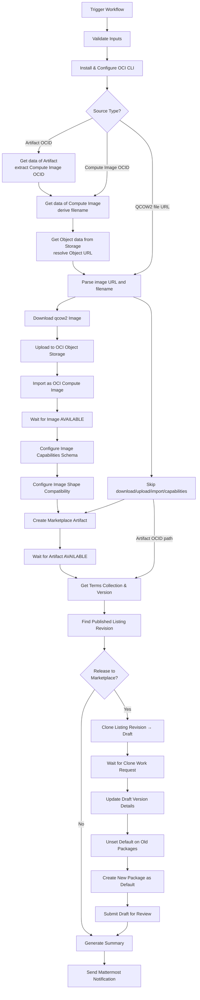

# Oracle Cloud Marketplace Publishing

## Overview

This repository includes a GitHub Actions workflow for automated publishing of AlmaLinux OS images to Oracle Cloud Marketplace.

> **Note:** Recently, Oracle Cloud Marketplace publishing and management was migrated to the Oracle Cloud Infrastructure (OCI) Console, replacing the previous Partner Portal. This migration made it significantly harder to discover the correct procedure and API calls for programmatic image publishing, as documentation for the new OCI Console-based workflow is sparse and the CLI options differ from what older guides describe.

## Files

### `.github/workflows/oci-marketplace-publish.yml`

Main workflow for end-to-end publishing of AlmaLinux OS images to Oracle Cloud Marketplace.

**What it does:**
- Accepts one of three image source types: a QCOW2 file URL, an existing Compute Image OCID, or an existing Marketplace Artifact OCID
- Validates the input format (URL pattern or OCID prefix)
- Depending on source type, resolves the image through different paths (see [Source Type Paths](#source-type-paths) below)
- Parses the image filename to extract version, architecture, date, and release info
- Finds the currently published Listing Revision for the matching AlmaLinux version/architecture
- Optionally: clones it into a new Draft Revision, creates a package linking artifact and terms, and submits for Oracle review
- Sends Mattermost notifications and generates a GitHub Actions job summary

**Usage:**
```
Trigger via GitHub UI: Actions → OCI Image to Marketplace release

Inputs:
  - image_source_type:      'QCOW2 file URL' | 'Compute Image OCID' | 'Artifact OCID'
  - image_source_data:      URL or OCID corresponding to the selected source type
  - release_to_marketplace: true/false (default: false)
  - notify_mattermost:      true/false (default: true)
```

### Input Validation

The workflow validates `image_source_data` immediately (before installing any tools) based on the selected source type:

| Source Type | Validation Rule |
|---|---|
| `QCOW2 file URL` | Must match `^https?://.+\.qcow2$` |
| `Compute Image OCID` | Must start with `ocid1.image.` |
| `Artifact OCID` | Must match `^ocid1..+artifact` (e.g., `ocid1.marketplacepublisherartifact.oc1..…`) |

## Source Type Paths

The workflow supports three different starting points, each skipping the steps that are not needed:

### 1. QCOW2 file URL (full pipeline)

All steps run. The workflow downloads the image, uploads to Object Storage, imports as a Compute Image, configures capabilities and shape compatibility, creates a Marketplace Artifact, and proceeds to marketplace release.

### 2. Compute Image OCID (skip download/upload/import/capabilities)

Starts from an existing OCI Compute Image. The workflow:
1. Fetches the Compute Image metadata and derives the filename
2. Searches Object Storage for the corresponding qcow2 object
3. Constructs the Object Storage URL for metadata parsing
4. Skips: Download, Upload, Import, Configure Capabilities, Configure Shape Compatibility
5. Creates a new Marketplace Artifact (if releasing)

### 3. Artifact OCID (skip everything up to marketplace release)

Starts from an existing Marketplace Artifact. The workflow:
1. Fetches the Artifact data and extracts the source Compute Image OCID
2. Fetches the Compute Image metadata (same as path 2)
3. Resolves the Object Storage URL (same as path 2)
4. Skips: Download, Upload, Import, Configure Capabilities, Configure Shape Compatibility, Create Artifact
5. Uses the provided Artifact directly for marketplace release

### Steps per Source Type

| Step | QCOW2 | Compute Image | Artifact |
|---|:---:|:---:|:---:|
| Validate inputs | ✅ | ✅ | ✅ |
| Install & Configure OCI CLI | ✅ | ✅ | ✅ |
| Get data of Artifact | — | — | ✅ |
| Get data of Compute Image | — | ✅ | ✅ |
| Get Object data from Storage | — | ✅ | ✅ |
| Parse image URL and filename | ✅ | ✅ | ✅ |
| Download qcow2 image | ✅ | — | — |
| Upload to OCI Object Storage | ✅ | — | — |
| Import as OCI Compute Image | ✅ | — | — |
| Configure Image Capabilities | ✅ | — | — |
| Configure Image Shape Compatibility | ✅ | — | — |
| Create the new Artifact | ✅¹ | ✅¹ | — |
| Get Terms Collection & Version | ✅ | ✅ | ✅ |
| Get latest Listing Revision | ✅ | ✅ | ✅ |
| Clone → Update → Package → Submit | ✅¹ | ✅¹ | ✅¹ |
| Print job summary | ✅ | ✅ | ✅ |
| Send Mattermost notification | ✅² | ✅² | ✅² |

¹ Only when `release_to_marketplace: true`
² Only when `notify_mattermost: true`

## Required GitHub Configuration

The following secrets and variables must be configured in the repository settings.

### Secrets
| Secret | Description |
|--------|-------------|
| `OCI_CLI_USER` | OCI user OCID |
| `OCI_CLI_TENANCY` | OCI tenancy OCID |
| `OCI_CLI_FINGERPRINT` | API key fingerprint |
| `OCI_CLI_KEY_CONTENT` | Private API key content (PEM) |
| `OCI_COMPARTMENT_ID` | Compartment OCID where images and artifacts are created |
| `OCI_OBJECT_STORAGE_NAMESPACE` | Object Storage namespace |

### Variables (`vars.*`)
| Variable | Description |
|----------|-------------|
| `OCI_CLI_REGION` | OCI region (e.g., `us-ashburn-1`) |
| `OCI_OBJECT_STORAGE_BUCKET` | Bucket name for image uploads |
| `MATTERMOST_CHANNEL` | Mattermost channel for notifications |

### Secrets (for notifications)
| Secret | Description |
|--------|-------------|
| `MATTERMOST_WEBHOOK_URL` | Mattermost incoming webhook URL |

## Prerequisites

Before running the workflow:

1. **Create OCI Object Storage Bucket**
   - Create a bucket for temporary image storage (if it doesn't exist)
   - Note the bucket name and namespace
   - Add as GitHub variable/secret respectively

2. **Verify IAM Permissions**
   The OCI API key user must have permissions for:
   - **Object Storage**: read/write access to the bucket
   - **Compute**: image import, image capability schema create/update
   - **Marketplace Publisher**: artifact create/get, listing revision clone/update, package create/update, work request get

3. **Ensure Published Listings Exist**
   The workflow dynamically discovers Marketplace Listings by name pattern (e.g., `AlmaLinux OS 9 (x86_64)`). Each listing must have at least one **PUBLISHED** revision to clone from.

4. **Ensure Terms Collection Exists**
   The workflow automatically finds the most recent ACTIVE terms collection and its latest version. At least one must exist in the compartment.

## Image URL and Naming Convention

All three source types ultimately resolve to an Object Storage URL for metadata extraction. The workflow expects qcow2 files with this URL structure:
```
https://{host}/…/images/{major}/{version}/oci/{release}/{filename}
```

### URL Examples
```
https://example.com/images/8/8.10/oci/20260202092731/AlmaLinux-8-OCI-8.10-20260202.x86_64.qcow2
https://example.com/images/9/9.6/oci/20260202092731/AlmaLinux-9-OCI-9.6-20260202.x86_64.qcow2
https://example.com/images/10/10.1/oci/20260216092731/AlmaLinux-10-OCI-10.1-20260216.0.aarch64.qcow2
```

### Filename Patterns
```
AlmaLinux-{major}-OCI-{version}-{date}.{arch}.qcow2
AlmaLinux-{major}-OCI-{version}-{date}.{index}.{arch}.qcow2
```

The second pattern (with `.{index}` suffix on date) is used for AlmaLinux 10+ images. It numbers the build iteration.

### Extracted Metadata

From **URL path** (e.g., `/images/8/8.10/oci/20260202092731/...`):
- `ALMA_RELEASE` — release timestamp directory in path

From **filename** (e.g., `AlmaLinux-8-OCI-8.10-20260202.x86_64.qcow2`):
- `ALMA_MAJOR` — major version (e.g., `8`)
- `ALMA_VERSION` — full version (e.g., `8.10`)
- `ALMA_DATE` — date with optional minor suffix (e.g., `20260202` or `20260216.0`)
- `ALMA_ARCH` — architecture (`x86_64` or `aarch64`)

The `PACKAGE_VERSION` is composed as `{ALMA_VERSION}.{ALMA_DATE}` (e.g., `8.10.20260202` or `10.1.20260216.0`).

### Code Names

The workflow maps versions to AlmaLinux code names (used in release notes links and descriptions). The mapping is hardcoded and must be updated manually when new AlmaLinux versions are released:

| Version | Code Name |
|---------|-----------|
| 8.10 | Cerulean Leopard |
| 9.7 | Moss Jungle Cat |
| 10.1 | Heliotrope Lion |

## Supported Listings

The workflow supports these 6 AlmaLinux OS Marketplace Listings:

1. AlmaLinux OS 8 (x86_64)
2. AlmaLinux OS 8 (AArch64)
3. AlmaLinux OS 9 (x86_64)
4. AlmaLinux OS 9 (AArch64)
5. AlmaLinux OS 10 (x86_64)
6. AlmaLinux OS 10 (AArch64/ARM64)

Listings are discovered dynamically by name pattern — no hardcoded OCIDs are needed.

## Workflow Process

### End-to-End Flow



### Image Capabilities

The workflow configures the following image capabilities on every imported image (QCOW2 path only):

| Capability | Value |
|------------|-------|
| Firmware | UEFI_64 |
| Secure Boot | Enabled |
| Launch Mode | PARAVIRTUALIZED |
| Network Attachment | PARAVIRTUALIZED |
| Boot Volume Type | PARAVIRTUALIZED |
| Local Data Volume Type | PARAVIRTUALIZED |
| Remote Data Volume Type | PARAVIRTUALIZED |
| Paravirtualization Version | 2 |
| Consistent Volume Naming | Enabled |
| In-transit Encryption | Enabled |
| Multipath Device Support | Enabled |
| IPv6 Only | Enabled |

These are set via the OCI Compute Image Capability Schema API, using the latest available global schema version (discovered dynamically).

### Shape Compatibility

After the image is imported (QCOW2 path only), the workflow configures shape compatibility entries on the Compute Image based on architecture. This is required because the Marketplace API needs Flex shapes to have explicit OCPU and memory constraints.

**For aarch64:**
1. Removes all default (x86_64) shapes from the image
2. Adds Ampere ARM shapes:
   - **Flex shapes** (`VM.Standard.A1.Flex`, `VM.Standard.A2.Flex`, `VM.Standard.A4.Flex`) — OCPU/memory limits are queried dynamically from `oci compute shape list`
   - **Bare Metal shapes** (`BM.Standard.A1.160`, `BM.Standard.A4.48`) — no constraints needed
   - `VM.Standard.Ampere.Generic` is excluded — it's an OCI alias for `A1.Flex` and adding it overwrites `A1.Flex`'s constraints

**For x86_64:**
1. Removes legacy/outdated shapes (Standard1, DenseIO1, HighIO1, Standard2T, BigData), ARM shapes (`.A1.`, `.A2.`, `.A4.`), and `*.Generic` alias shapes
2. Configures remaining Flex shapes with OCPU/memory constraints:
   - Each Flex shape is **removed then re-added** (because `add` silently skips shapes that already exist without updating constraints)
   - Constraints are queried dynamically from `oci compute shape list`
   - Shapes not available in the compartment/region or missing constraint data are removed

### Marketplace Artifact

Each artifact is created with:
- `sourceImageId` — the Compute Image OCID
- `username: "opc"` — the default SSH login user
- `isSnapshotAllowed: true`
- `imageShapeCompatibilityEntries` — shape compatibility entries from the Compute Image, with:
  - `*.Generic` alias shapes filtered out (e.g., `VM.Standard.Ampere.Generic`, `VM.Standard.AMD.Generic`) — OCI adds these automatically but the Marketplace API rejects them
  - `memoryConstraints` (`minInGBs`, `maxInGBs`) and `ocpuConstraints` (`min`, `max`) included for all Flex shapes

When the source type is `Artifact OCID`, artifact creation is skipped entirely — the provided artifact is reused directly.

### Listing Revision Lifecycle

1. **Clone** the currently PUBLISHED revision → creates a NEW (draft) revision
2. **Update** the draft's version details (version number, release date, release notes link), headline, and tagline
3. **Unset default** on any existing default packages in the draft
4. **Create** a new package as default (linking artifact + terms + version)
5. **Submit** the draft for Oracle review

After Oracle approves the revision, it must be **published manually** from the OCI Console. Publishing the new revision automatically unpublishes the previous one.

## Manual Steps After Workflow Completes

1. **Wait for Oracle to approve** the submitted revision (check status in OCI Console)
2. **Publish** the approved revision from the [OCI Publisher Console](https://cloud.oracle.com/publisher) — the previous revision is automatically unpublished

## Testing

1. **Dry Run** (recommended for first test)
   - Set `release_to_marketplace: false`
   - For **QCOW2 file URL**: performs download → upload → import → capabilities → shape compatibility (no artifact, no marketplace)
   - For **Compute Image OCID**: resolves image and Object Storage data only
   - For **Artifact OCID**: resolves artifact, image, and Object Storage data only
   - Verify the parsed metadata in the job summary

2. **Full Run**
   - Set `release_to_marketplace: true`
   - Performs the complete end-to-end flow for the selected source type
   - Monitor the workflow execution in GitHub Actions
   - Check the draft revision in the OCI Publisher Console after completion

## Troubleshooting

### Common Issues

1. **"Invalid URL" / "Invalid OCID" validation error**
   - The workflow validates `image_source_data` format before doing anything else
   - For QCOW2: must start with `http://` or `https://` and end with `.qcow2`
   - For Compute Image OCID: must start with `ocid1.image.`
   - For Artifact OCID: must match `ocid1.…artifact` pattern

2. **"Invalid image filename format" error**
   - Ensure the qcow2 filename follows the naming convention
   - Both `AlmaLinux-8-OCI-8.10-20260202.x86_64.qcow2` and `AlmaLinux-10-OCI-10.1-20260216.0.aarch64.qcow2` formats are supported

3. **"Failed to get artifact data" error**
   - Verify the Artifact OCID is correct and the artifact exists in the configured compartment
   - Ensure the OCI API key user has `marketplace-publisher artifact get` permission

4. **"Failed to extract source image ID from artifact" error**
   - The artifact must be a machine image artifact (type `OCI_COMPUTE_IMAGE`)
   - The `machine-image.source-image-id` field must be present

5. **"Image is not AVAILABLE" error**
   - For Compute Image OCID / Artifact OCID: the referenced compute image must be in AVAILABLE state
   - For QCOW2 imports: wait for the import to complete (up to 30 minutes)

6. **"Object not found in Object Storage" error**
   - The workflow searches Object Storage for a matching qcow2 file by prefix derived from the image display name
   - Verify the image was previously uploaded to the expected bucket and path
   - Check that `OCI_OBJECT_STORAGE_BUCKET` (variable) and `OCI_OBJECT_STORAGE_NAMESPACE` (secret) are correct

7. **"Failed to download image" error**
   - Verify the image URL is publicly accessible
   - Check network connectivity from GitHub runners

8. **"Image is not in QCOW format" error**
   - The workflow verifies the downloaded file is actually a QCOW image using `file` command
   - Ensure the URL points to a valid qcow2 file (not an HTML error page)

9. **Image import timeout**
   - Import waits up to 30 minutes (polling every 30 seconds)
   - Large images may take longer; increase `MAX_WAIT_SECONDS` if needed

10. **Image capability schema errors**
    - The workflow dynamically discovers the latest global capability schema version
    - If `create` fails (schema may already exist for the image), it falls back to `update`

11. **"Invalid Shape … is flexible, must have memory and OCPU constraints" error**
    - The Marketplace API requires explicit `memoryConstraints` and `ocpuConstraints` for all Flex shapes
    - The workflow configures these automatically by querying `oci compute shape list`
    - If a Flex shape is not available in the compartment/region, it is removed from the image

12. **"Invalid Shape … does not exist" error (e.g., `VM.Standard.Ampere.Generic`)**
    - OCI auto-adds `*.Generic` alias shapes (e.g., `VM.Standard.Ampere.Generic`, `VM.Standard.AMD.Generic`) to Compute Images
    - The Marketplace API does not recognize these aliases
    - The workflow filters them out using `endswith(".Generic")` in the artifact payload `jq` transformation

13. **Artifact creation timeout**
    - Artifact creation waits up to 45 minutes (polling every 30 seconds)
    - This involves Oracle validating and processing the machine image

14. **"Listing revision is not in New status" error**
    - Packages can only be added to revisions with status `NEW` (draft)
    - The workflow clones the PUBLISHED revision to create a NEW draft; this error means the clone or lookup failed

15. **"Unknown resource" error on package creation (term-id)**
    - Ensure the Terms Collection has an ACTIVE version
    - The workflow passes the Term Collection ID (not the Term Version ID) to the package create command

16. **"Invalid releaseDate format" error**
    - The OCI API expects date format `EEE MMM dd yyyy` (e.g., `Sat Feb 01 2026`)
    - The workflow formats this automatically using `date -d`

### Linter Warnings

GitHub Actions YAML linter may show warnings about context access for environment variables set via `$GITHUB_ENV`. These are false positives — the workflow functions correctly.

## Support

- OCI Publisher Console: https://cloud.oracle.com/publisher
- OCI Marketplace Documentation: https://docs.oracle.com/en-us/iaas/Content/Marketplace/home.htm
- Image Capabilities Documentation: https://docs.oracle.com/en-us/iaas/Content/Compute/Tasks/configuringimagecapabilities.htm
- AlmaLinux Cloud SIG Chat: https://chat.almalinux.org/almalinux/channels/sigcloud
- Workflow run logs: GitHub Actions tab in the repository
