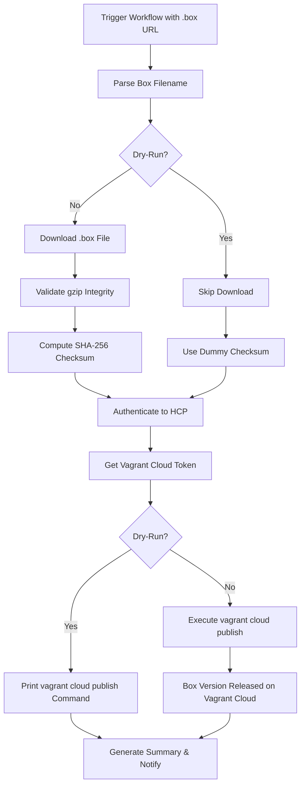

# Vagrant Cloud Publishing

## Overview

This repository includes a GitHub Actions workflow for publishing AlmaLinux OS Vagrant boxes to Vagrant Cloud (via HashiCorp Cloud Platform).

## Files

### `.github/workflows/vagrant-cloud-publish.yaml`

Workflow for publishing Vagrant box images to Vagrant Cloud.

**What it does:**
- Accepts a URL to a `.box` image file
- Parses the filename to extract version, provider, architecture, and date
- Downloads the box file and validates it (gzip integrity check)
- Authenticates to HashiCorp Cloud Platform (HCP) using service principal credentials
- Computes SHA-256 checksum of the box file
- Publishes the box to Vagrant Cloud using `vagrant cloud publish` with direct upload
- Automatically releases the published version
- Supports dry-run mode for testing without uploading
- Sends Mattermost notifications and generates job summaries

**Usage:**
```
Trigger via GitHub UI: Actions → Vagrant Cloud publish

Inputs:
  - image_url:         URL to the .box image file (required)
  - dry-run-mode:      Dry-run mode (default: true)
  - notify_mattermost: Send notification to Mattermost (default: false)
```

## Required GitHub Configuration

### Secrets
| Secret | Description |
|--------|-------------|
| `HCP_CLIENT_ID` | HashiCorp Cloud Platform service principal client ID |
| `HCP_CLIENT_SECRET` | HashiCorp Cloud Platform service principal client secret |
| `GIT_HUB_TOKEN` | GitHub PAT (used for Packer GitHub API token) |
| `MATTERMOST_WEBHOOK_URL` | Mattermost incoming webhook URL |

### Variables (`vars.*`)
| Variable | Description |
|----------|-------------|
| `HCP_ORG` | HCP organization name for Vagrant Cloud (e.g., `almalinux`) |
| `MATTERMOST_CHANNEL` | Mattermost channel for notifications |

## Prerequisites

1. **HashiCorp Cloud Platform Service Principal**
   - Create an HCP service principal with permissions to manage Vagrant boxes
   - The workflow authenticates via `hcp auth login` using client ID and secret, then obtains a `VAGRANT_CLOUD_TOKEN`

2. **Vagrant Cloud Boxes**
   - Boxes must already exist in Vagrant Cloud under the HCP organization
   - The workflow creates new **versions** of existing boxes — it does not create boxes from scratch

3. **Box Naming Convention**
   - Box names on Vagrant Cloud follow the pattern: `{HCP_ORG}/{version_major}` with optional suffixes
   - See [Box Name Mapping](#box-name-mapping) for details

## Box Filename Patterns

The workflow supports two filename formats:

### Modern / Kitten Format
```
AlmaLinux-{major|Kitten}-Vagrant-{provider}-{version}-{date}.{index}.{arch}[_v2].box
```

Examples:
```
AlmaLinux-9-Vagrant-virtualbox-9.6-20250522.0.x86_64.box
AlmaLinux-9-Vagrant-libvirt-9.6-20250522.0.aarch64.box
AlmaLinux-10-Vagrant-virtualbox-10.1-20260216.0.x86_64.box
AlmaLinux-10-Vagrant-vmware-10.1-20260216.0.x86_64_v2.box
AlmaLinux-Kitten-Vagrant-libvirt-10-20250813.0.x86_64.box
```

**Note:** The `_v2` suffix (x86_64_v2 microarchitecture) is available for AlmaLinux 10 and Kitten 10 only.

### Legacy Format (AlmaLinux 8)
```
AlmaLinux-{major}-Vagrant-{version}-{date}.{arch}.{provider}.box
```

Examples:
```
AlmaLinux-8-Vagrant-8.10-20260202.x86_64.virtualbox.box
AlmaLinux-8-Vagrant-8.10-20260202.aarch64.libvirt.box
```

### Extracted Metadata

| Field | Description | Example |
|-------|-------------|---------|
| `version_major` | Box name identifier with suffixes | `9`, `10-kitten`, `10-x86_64_v2` |
| `vagrant_provider` | Vagrant provider name | `virtualbox`, `libvirt`, `vmware_desktop` |
| `release_version` | AlmaLinux version | `9.6`, `10.1`, `10` |
| `date_stamp` | Build date (index stripped for non-Kitten) | `20250522`, `20250813.0` |
| `architecture` | CPU architecture | `x86_64`, `aarch64` |

**Note:** The provider name `vmware` in the filename is automatically remapped to `vmware_desktop` (the correct Vagrant provider name).

## Box Name Mapping

The Vagrant Cloud box name is constructed as `{HCP_ORG}/{version_major}`, where `version_major` is built from the parsed metadata:

| Source | Major | Kitten? | v2 Suffix? | `version_major` | Full Box Name |
|--------|-------|---------|------------|-----------------|---------------|
| AlmaLinux 8 | 8 | No | No | `8` | `{org}/8` |
| AlmaLinux 9 | 9 | No | No | `9` | `{org}/9` |
| AlmaLinux 10 | 10 | No | No | `10` | `{org}/10` |
| AlmaLinux 10 (v2) | 10 | No | Yes | `10-x86_64_v2` | `{org}/10-x86_64_v2` |
| Kitten 10 | 10 | Yes | No | `10-kitten` | `{org}/10-kitten` |
| Kitten 10 (v2) | 10 | Yes | Yes | `10-kitten-x86_64_v2` | `{org}/10-kitten-x86_64_v2` |

The box **version** on Vagrant Cloud is `{release_version}.{date_stamp}` (e.g., `9.6.20250522` or `10.20250813.0`).

## Supported Providers

| Provider in Filename | Vagrant Provider Name | Description |
|---------------------|----------------------|-------------|
| `virtualbox` | `virtualbox` | Oracle VirtualBox |
| `libvirt` | `libvirt` | KVM/QEMU via libvirt |
| `vmware` | `vmware_desktop` | VMware Desktop (Fusion/Workstation) |

## Workflow Process



### Publish Details

The `vagrant cloud publish` command is called with:

| Flag | Description |
|------|-------------|
| `-C sha256` | Checksum type |
| `-c {checksum}` | SHA-256 checksum of the box file |
| `--release` | Automatically release the version after upload |
| `-a {arch}` | Architecture (`amd64` or `arm64`) |
| `--direct-upload` | Upload directly to Vagrant Cloud storage |
| `--debug` | Enable debug output |
| `-f` | Force overwrite if version already exists |

**Note:** The architecture is remapped from the filename convention: `x86_64` → `amd64`, `aarch64` → `arm64`.

## Testing

1. **Dry-Run Mode** (default)
   - Set `dry-run-mode: true`
   - Skips downloading the box file
   - Uses a dummy checksum (`xxx...`)
   - Prints the `vagrant cloud publish` command without executing it
   - Useful for verifying filename parsing and parameter generation

2. **Actual Publish**
   - Set `dry-run-mode: false`
   - Downloads, validates, checksums, and uploads the box to Vagrant Cloud
   - The version is automatically released upon successful upload

## Troubleshooting

### Common Issues

1. **"No pattern matched for filename" error**
   - The box filename doesn't match either the modern or legacy pattern
   - Check for typos in the filename or unexpected characters

2. **Download or gzip validation fails**
   - Verify the image URL is publicly accessible
   - Ensure the file is a valid gzip-compressed Vagrant box

3. **HCP authentication fails**
   - Verify `HCP_CLIENT_ID` and `HCP_CLIENT_SECRET` secrets are correct
   - Ensure the service principal has Vagrant Cloud permissions

4. **`vagrant cloud publish` fails**
   - Ensure the box already exists in Vagrant Cloud under `{HCP_ORG}/{version_major}`
   - Check that the provider name is valid
   - If a version already exists, the `-f` flag should handle overwriting

5. **Box download runs out of disk space**
   - The workflow downloads to `/mnt` which has ~70 GB on GitHub runners
   - Ensure the box file fits within this limit

## Support

- Vagrant Cloud (HCP): https://portal.cloud.hashicorp.com/vagrant/discover
- Vagrant Documentation: https://developer.hashicorp.com/vagrant/docs
- AlmaLinux Cloud SIG Chat: https://chat.almalinux.org/almalinux/channels/sigcloud
- Workflow run logs: GitHub Actions tab in the repository
